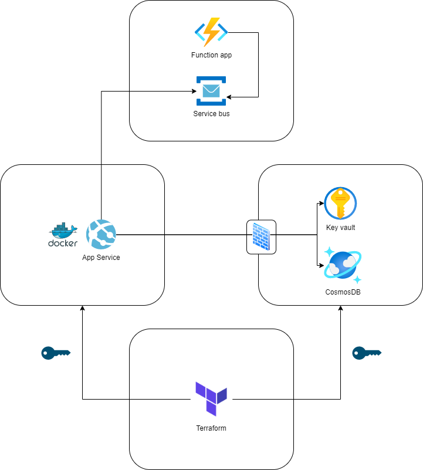

# IC3000-package (Insurance claim API system)

## Introduction
Repository to collect all source code related to the IC3000 project.

## Specification

### Backend/API
REST API (GET, POST, DELETE)
Claim

Id: int

Year: int

Name: string

Type: enum {Collision, Grounding, Bad Weather, Fire}

DamageCost: Decimal

ASP.NET Core Web application that returns appropriate http code and error messages.

### Storage
Azure Cosmos DB

### Logic restrictions
Claims that exceed 100.000 cannot be created.

Year of date cannot be in the future or more than 10 years backwards.

Solution: Establish "Insert" triggers in DBMS to validate incomming data.

### Auditing
Push change events of claims to Azure service bus and subscribe to the queue with an azure function trigger.
